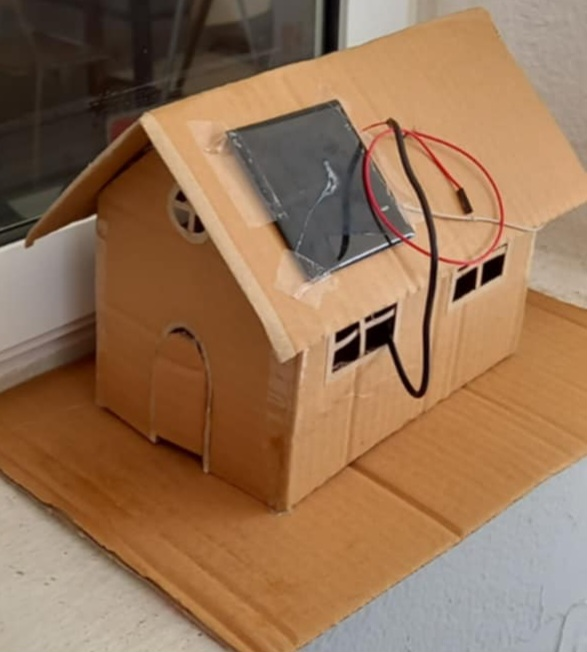
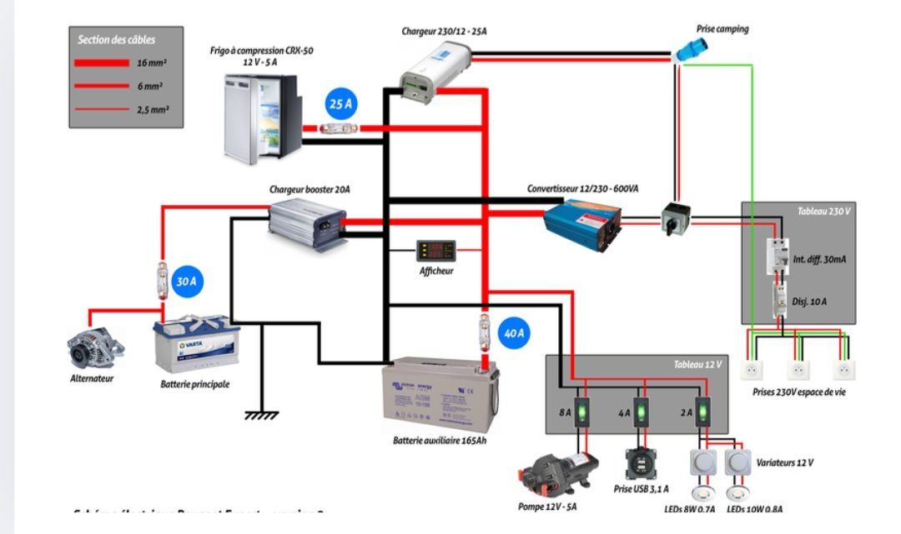

# Design and Modeling of a Photovoltaic Power Plant

Welcome to the repository of my academic project focused on the design and modeling of a photovoltaic (PV) power plant.

---

## 📂 Repository Contents

- 📄 **Project Report (PDF)**  
  Detailed study, design, sizing, and simulation results of the PV plant.  
  File: `centrale-photovoltaique_Project.VC1-Report-2.pdf`

- 🖼️ **Project Images**  
    
  

---

## 📄 Download the Report

You can download the full project report here:  
[centrale-photovoltaique_Project.VC1-Report-2.pdf](./centrale-photovoltaique_Project.VC1-Report-2.pdf)

---

## 🚀 Project Overview

This project covers:

- Fundamentals and principles of photovoltaic power generation ☀️  
- Detailed design and optimal sizing of a PV power plant  
- Simulation of energy production and system performance analysis  
- Assessment of technical and environmental parameters impacting plant output 🌍  

---

## 📢 Tags

#Photovoltaic #RenewableEnergy #Engineering #EnergyTransition #AcademicProject

---

Thank you for visiting my project repository!  
Feel free to reach out if you want to discuss or collaborate.

---

*Khouloud Othmani*
